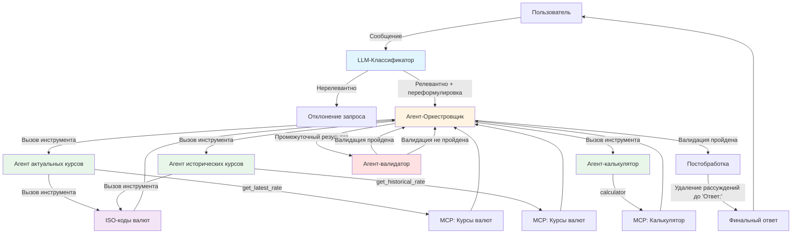

# Financial Assistant

AI-агент для анализа валют, созданный с использованием Langflow и GigaChat. Агент помогает получать текущие и исторические данные о валютах и выполнять аналитические расчёты.

## ✨ Возможности

- 📊 Курсы валют в реальном времени
- 📈 Анализ исторических данных
- 🧮 Базовые аналитические расчёты
- 🔧 Расширяемая архитектура на базе Langflow

## 🛠 Технологический стек

- **Langflow** - визуальный фреймворк для создания AI-агентов
- **GigaChat** / **LM Studio** - языковые модели
- **PostgreSQL** - база данных для Langflow
- **Docker & Docker Compose** - контейнеризация
- **ExchangeRate API** - источник данных о валютах
- **Langfuse** - логирование работы
- **Python 3.11+**

## 🛠 Описание решения и архитектуры

Система представляет собой многоуровневую агентскую архитектуру для финансового ассистента, анализирующего курсы валют. Реализация основана на Langflow с интеграцией MCP-серверов в langflow для получения актуальных и исторических данных о валютах.

### Диаграмма архитектуры




## 📋 Требования

- Docker и Docker Compose
- Python 3.11 или выше (для локальной разработки)
- API ключи:
  - ExchangeRate API - для получения данных о валютах
  - GigaChat API - для языковой модели

## 🚀 Установка и запуск

### 1. Клонирование репозитория

```bash
git clone https://github.com/Timik232/langflow-exchange.git
cd langflow-exchange
```

### 2. Настройка окружения

Скопируйте файл с примером переменных окружения:

```bash
cp .env.example .env
```

Отредактируйте `.env` и добавьте свои API ключи:

```env
# API ключи
EXCHANGERATE_API_KEY=ваш_ключ_exchangerate_api
GIGA_API_KEY=ваш_ключ_gigachat_api

# Настройки Langflow
LANGFLOW_PORT=7860
LANGFLOW_MCP_PORT=8000

# Настройки PostgreSQL
POSTGRES_USER=langflow
POSTGRES_PASSWORD=langflow
POSTGRES_DB=langflow

# настройка LangFuse, если нужно
LANGFUSE_SECRET_KEY=langfuse_secret_key_if_needed
LANGFUSE_PUBLIC_KEY=langfuse_public_key_if_needed
LANGFUSE_HOST=https://cloud.langfuse.com
```

### 3. Запуск проекта

Запустите все сервисы через Docker Compose:

```bash
docker compose up -d
```

### 4. Доступ к интерфейсу

По умолчанию после запуска Langflow будет доступен по адресу:

```
http://localhost:7860
```
### 5. Запуск Financial Agent
Открыть flow financial agent 
Gigachat по какой-то причине корректно не подключает агентов к основному агенту-оркестровщику, поэтому использовался lm studio: необходимо прописать URL и модель для lm studio. Либо заменить провайдера и поменять модель.
После этого запустить playground.

**Примечание**
MCP server не сохраняет значение своих инструментов после сохранения flow, поэтому по умолчанию они все всегда будут включены: возможно, придётся у exchange currency agent оставить только инструмент get_latest_rate. 
При этом у агента прописано, какой инструмент вызывать, поэтому это может и не вызывать проблем.

## 📁 Структура проекта

```
langflow-exchange/
├──data/                          # Директория для дополнительных файлов
│  └──converting.json             # Вспомогательный файл для ISO кодов
├── flows/                        # Флоу Langflow
│   ├── Financial agent.json      # Основной финансовый агент
│   ├── get_historical_rate.json  # Флоу для получения исторического курса валют
│   └── get_latest_rate.json      # Флоу для получения курсов валют
├── compose.yaml                  # Конфигурация Docker Compose
├── Dockerfile                    # Docker образ для Langflow
├── pyproject.toml                # Зависимости Python
├── .env.example                  # Пример переменных окружения
└── README.md                     # Документация
```

## ⚙️ Конфигурация

### Переменные окружения

| Переменная | Описание | Значение по умолчанию |
|------------|----------|----------------------|
| `EXCHANGERATE_API_KEY` | API ключ для ExchangeRate API | - |
| `GIGA_API_KEY` | API ключ для GigaChat | - |
| `LANGFLOW_PORT` | Порт веб-интерфейса Langflow | 7860 |
| `LANGFLOW_MCP_PORT` | Порт MCP сервера | 8000 |
| `POSTGRES_USER` | Пользователь PostgreSQL | langflow |
| `POSTGRES_PASSWORD` | Пароль PostgreSQL | langflow |
| `POSTGRES_DB` | Имя базы данных | langflow |
| `LANGFUSE_SECRET_KEY` | Секретный ключ для langfuse | - |
| `LANGFUSE_PUBLIC_KEY` | Публичный ключ для langfuse | - |
| `LANGFUSE_HOST` | host для langfuse | https://cloud.langfuse.com |

## 🎯 Доступные флоу

### Financial agent.json

Основной агент для финансового анализа. Включает:

- Интеграцию с LLM для обработки запросов
- Инструменты для получения курсов валют
- Калькулятор для вычислений
- Агентскую логику для комплексного анализа

### get_latest_rate.json

Специализированный flow в форме MCP-server для получения актуальных курсов валют через ExchangeRate API.

### get_historical_rate.json

Специализированный flow для получения исторических курсов валют через ЦБ РФ.

## 💡 Использование

1. Откройте веб-интерфейс Langflow:
   ```
   http://localhost:7860
   ```
2. Выберите флоу "Financial agent" из списка
3. Запустите флоу и начните взаимодействие с агентом
4. Примеры запросов:
   - "Какой текущий курс USD к RUB?"
   - "Рассчитай, сколько долларов я получу за 10000 рублей"

## 🔧 Разработка

### Локальная установка зависимостей

```bash
# Установите uv (если ещё не установлен)
pip install uv

# Установите зависимости
uv sync

# При необходимости установите dev-зависимости
uv sync --group dev
```

### Локальный запуск Langflow

**Важно:** При локальном запуске необходимо вручную заменить API токены внутри flow, так как переменные окружения автоматически не подставляются в компоненты флоу без докер контейнера.

```bash
uv run langflow run
```

После запуска:

1. Откройте веб-интерфейс по адресу `http://localhost:7860`
2. Импортируйте нужный флоу из директории `flows/`
3. Вручную замените значения токенов в компонентах в finance agent flow и в get_current_rate:
   - В компонентах GigaChat замените `GIGA_API_KEY` на ваш реальный ключ
   - В компонентах ExchangeRate API замените `EXCHANGERATE_API_KEY` на ваш реальный ключ
4. Сохраните изменения в флоу

## 📊 Остановка и очистка

### Остановка сервисов

```bash
docker compose down
```

### Полная очистка (включая данные)

```bash
docker compose down -v
```

## ❓ Описание встреченных проблем и их решений при разработке

- У гигачата нет явной возможности вызывать structured output, по крайней мере я не смог найти, поэтому его пришлось реализовать следующим образом: формировать псевдо-функцию через Json схему, указывая у неё аргументы. Зарегистрировать функцию в tool_calling у gigachat, затем попытаться её вызывать. Gigachat формирует аргументы для этой функции в формате, который мы описали в json-схеме. Мы на выход подаём только сформированные аргументы. Таким образом, мы получаем формат словаря с полями, которые мы сами описали.
- При получении исторического курса валют иногда бывает такое, что на какие-то даты у ЦБ РФ не сохранена информация по курсу. В таком случае пробуем получить курс на предыдущую дату и в ответе пишем, что на заданную дату курс не был найден, но был найден на другую: после чего указывается число, на которое курс был получен.
- Несмотря на строгое указание в промпте не писать размышления в ответе, не упоминать результат валидатора,, писать только ответ пользователю и т.п., маленькие модели всё равно галлюцинировали и продолжали это писать. Поэтому было решено добавить указание: начинай фразу для пользователя со слова: "Ответ:". Модель продолжает писать рассуждения перед этим, но для пользователя начала почти всегда добавлять это слово с двоеточием, по которому можно убрать лишнюю информацию в выводе, благодаря чему ответ выглядит более лаконично.

## 👤 Автор

[Тимур](https://github.com/Timik232)

## ❓ Решение проблем при запуске

### Порты уже используются

Если порты 7860 или 8000 уже заняты, измените их в `.env`

### entrypoint.sh: no such file or directory

Убедитесь, что файл entrypoint.sh имеет LF окончание. Иногда бывает, что он автоматически заменяется на CRLF. 

### Проблемы с API ключами

Убедитесь, что:

- API ключи правильно скопированы в `.env`
- Отсутствуют лишние пробелы или кавычки
- Ключи активны и не истекли

### Проблемы с токенами в локальном запуске

При локальном запуске Langflow переменные окружения не подставляются автоматически в компоненты флоу. Необходимо:

1. Открыть флоу в веб-интерфейсе
2. Найти все компоненты, использующие API ключи
3. Вручную заменить плейсхолдеры (`GIGA_API_KEY`, `EXCHANGERATE_API_KEY`) на реальные значения
4. Сохранить флоу перед использованием

## 🔗 Ссылки, которые использовались в решении

- [Документация Langflow](https://docs.langflow.org/)
- [Документация GigaChat API](https://developers.sber.ru/docs/ru/gigachat/api/overview)
- [Документация ExchangeRate API](https://www.exchangerate-api.com/docs/overview)

